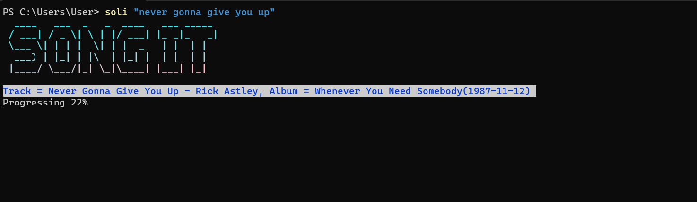

# Songit <br>
*songit more like sangeet(music) is a CLI application to download any music you want*<br>

<br>

## Get Started/Installation

**Download**
[`Install this Github repo`](https://github.com/shree5-png/songit-cli.git)<br>


*or*

```sh
Git clone https://github.com/shree5-png/songit-cli.git
cd songit
npm install -g
```

## Setup

To setup Spotify Client

```sh
soli -c
```

*This will open a config file where you put your client id and pass*<br>
*However you can still download without need of spotify just `soli -raw "never gonna give you up"`, -raw is necessary*<br>

## Run/Usage

**Without spotify**

*Songs name*
```sh
soli -raw "Never gonna give you up"
```

*Video url (youtube)*
```sh
 soli -raw "https://youtu.be/S-Kf6CnJC2w?si=ot3YAdgkWmmcZJUW"
```

**With spotify**

*Songs name*
```sh
soli "Never gonna give you up"
```

*Track url (spotify)*
```sh
soli "https://open.spotify.com/track/4PTG3Z6ehGkBFwjybzWkR8?si=ecff2d7fb8c74936"
```

*Album url (spotify)*
```sh
soli "https://open.spotify.com/album/3wITH77YIxYdtVv1W4W1SI?si=7RuOwNOUTaCAaFoZSjCg-Q"
```


## Notes

*> It is recommended to configure spotify for better experience.*<br>
*> Using link to download any song has higher accuracy*<br>
*> While downloading album, songs will be downloaded synchronously*<br>
*> Make sure to keep updating, as new features will keep being added on*


